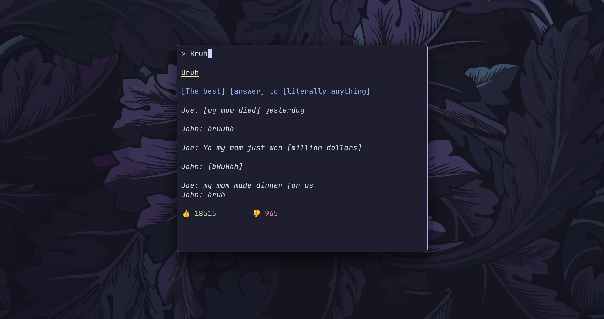

# 📖 LinGo

A CLI for Urban Dictionary, built using the [Bubble Tea](https://github.com/charmbracelet/bubbletea) framework in Go. It fetches definitions and examples of slang terms from the Urban Dictionary API and displays them in a styled terminal output.



## ✨ Features

- Search for terms and get their definitions and examples from Urban Dictionary
- Provides a rich, interactive and easy-to-use TUI built with the [Bubble Tea](https://github.com/charmbracelet/bubbletea)
- Styled output with colors for enhanced readability

## 🛠️ Installation

1. **Clone the repository**:

```bash
git clone https://github.com/ashish0kumar/LinGo.git
cd LinGo
```

2. **Build the application**:

```bash
go build
```

3. **Run the application**:

```bash
./LinGo
```

<br>

**Configure Global CLI Access (Optional)**

- Move the executable to a directory in your system’s PATH (e.g., `/usr/local/bin`):

```bash
sudo mv LinGo /usr/local/bin/
```

- Once the executable is set up, you can run `LinGo` from any directory:

```bash
LinGo
```

## 🔧 Usage

```bash
./LinGo
```

**Example Output**

```
> Bruh 

Bruh

[The best] [answer] to [literally anything]

Joe: [my mom died] yesterday

John: bruuhh

Joe: Yo my mom just won [million dollars]

John: [bRuHhh]

Joe: my mom made dinner for us
John: bruh

👍 18515        👎 965
```
